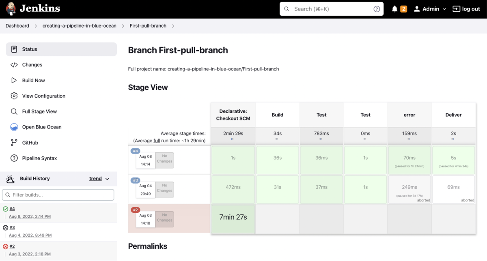

## Start working with jenkins:

 Login to jenkins:

Login to jenkins account jenkins .This link will bring up the Jenkins Login page.

Once we logged in to jenkins account, we can see our projects.

Here we can see our working projects in Staging menu.

### Lets Trigger a build:

- Select the project to which we want to trigger a build from the staging menu.

- Now click on the project to configure and trigger a build.

- Select Build now to start a build from left menu bar.

- We can check the build history to make sure that the build was triggered.

- Once the build is completed, a status of the build will be shown with green colored mark if the build was successful and red for build failure.

- Click on build number to open the build Status:

Select console output option from left menu to see the logs.

### Open Blue Ocean:

Blue Ocean is a new user experience for Jenkins based on a personalizable, modern design that allows users to graphically create, visualize and diagnose Continuous Delivery (CD) Pipelines.

### Jenkins Pipeline:

Following are the Stages involved in the gsweb-ts project Automation Build. When you Triggered a build, All these tests are achieved.

### Stageview

