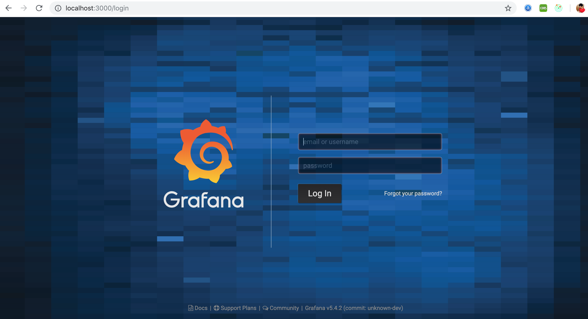

 It is a multi-platform open source analytics and interactive visualization web application.that allow you to analyze and display data from various sources in real time.it provides a powerful and flexible way to create interactive dashboards,graphs,charts for monitoring and analyzing metrics,logs,other time series data.

## Grafana Installation

### Prerequisites


**Install Grafana on CentOS 8**

Grafana can be installed on CentOS 8 from YUM repository or by manually downloading and installing .rpm package. The former is preferred method since it is easy to update and uninstall Grafana with the yum package manager.

**Add Grafana 8 YUM repository**

Run the commands below as user with sudo privileges or as root user to add repository content.

```
cat <<EOF | sudo tee /etc/yum.repos.d/grafana.repo
[grafana]
name=grafana
baseurl=https://packages.grafana.com/oss/rpm
repo_gpgcheck=1
enabled=1
gpgcheck=1
gpgkey=https://packages.grafana.com/gpg.key
sslverify=1
sslcacert=/etc/pki/tls/certs/ca-bundle.crt
EOF
```

You can optionally update you cache index for available packages:

```
sudo dnf makecache
```

### Install Grafana 8 on CentOS 8

When repository for Grafana has been configured, Grafana can be easily installed by running the commands below:

```
sudo dnf -y install grafana 
```

Package info:

```
$ rpm -qi grafana
Name        : grafana
Version     : 8.0.4
Release     : 1
Architecture: x86_64
Install Date: Fri 02 Jul 2021 02:05:25 AM EAT
Group       : default
Size        : 181997268
License     : "Apache 2.0"
Signature   : RSA/SHA256, Thu 01 Jul 2021 03:47:43 PM EAT, Key ID 8c8c34c524098cb6
Source RPM  : grafana-8.0.4-1.src.rpm
Build Date  : Thu 01 Jul 2021 03:47:14 PM EAT
Build Host  : 623ddf8d9e19
Relocations : /
Packager    : contact@grafana.com
Vendor      : Grafana
URL         : https://grafana.com
Summary     : Grafana
```

### Start Grafana Service

Grafana service is managed by systemd. Start the service and enable it to start on boot.

``` 
$ sudo systemctl enable --now grafana-server.service 
 Synchronizing state of grafana-server.service with SysV service script with /usr/lib/systemd/systemd-sysv-install.
 Executing: /usr/lib/systemd/systemd-sysv-install enable grafana-server
 Created symlink /etc/systemd/system/multi-user.target.wants/grafana-server.service → /usr/lib/systemd/system/grafana-server.service. 
 ```

The default port used is 3000. If you have another process using this port, you’ll need to set custom port in Grafana configuration file /etc/grafana/grafana.ini.

```
http_port = 3000 
```

Your grafana-server service should show running state.

```
$ systemctl status grafana-server.service 
 ● grafana-server.service - Grafana instance
    Loaded: loaded (/usr/lib/systemd/system/grafana-server.service; enabled; vendor preset: disabled)
    Active: active (running) since Thu 2019-01-10 23:18:24 EAT; 3min 12s ago
      Docs: http://docs.grafana.org
  Main PID: 2974 (grafana-server)
     Tasks: 9 (limit: 11510)
    Memory: 17.3M
    CGroup: /system.slice/grafana-server.service
            └─2974 /usr/sbin/grafana-server --config=/etc/grafana/grafana.ini --pidfile=/var/run/grafana/grafana-server.pid --packaging=rpm cfg:default>
 Jan 10 23:18:24 rhel8.local grafana-server[2974]: t=2019-01-10T23:18:24+0300 lvl=info msg="Initializing CleanUpService" logger=server
 Jan 10 23:18:24 rhel8.local grafana-server[2974]: t=2019-01-10T23:18:24+0300 lvl=info msg="Initializing NotificationService" logger=server
 Jan 10 23:18:24 rhel8.local grafana-server[2974]: t=2019-01-10T23:18:24+0300 lvl=info msg="Initializing ProvisioningService" logger=server
 Jan 10 23:18:24 rhel8.local grafana-server[2974]: t=2019-01-10T23:18:24+0300 lvl=info msg="Initializing PluginManager" logger=server
 Jan 10 23:18:24 rhel8.local grafana-server[2974]: t=2019-01-10T23:18:24+0300 lvl=info msg="Starting plugin search" logger=plugins
 Jan 10 23:18:24 rhel8.local grafana-server[2974]: t=2019-01-10T23:18:24+0300 lvl=info msg="Plugin dir created" logger=plugins dir=/var/lib/grafana/plu>
 Jan 10 23:18:24 rhel8.local grafana-server[2974]: t=2019-01-10T23:18:24+0300 lvl=info msg="Initializing TracingService" logger=server
 Jan 10 23:18:24 rhel8.local grafana-server[2974]: t=2019-01-10T23:18:24+0300 lvl=info msg="Initializing Stream Manager"
 Jan 10 23:18:24 rhel8.local grafana-server[2974]: t=2019-01-10T23:18:24+0300 lvl=info msg="HTTP Server Listen" logger=http.server address=0.0.0.0:3000>
 Jan 10 23:18:24 rhel8.local systemd[1]: Started Grafana instance.
 ```

### Open firewall port for Grafana

If you have a running firewalld service, allow port 3000for access to the dashboard from the network:

```
sudo firewall-cmd --add-port=3000/tcp --permanent
sudo firewall-cmd --reload
```

### Access Grafana Dashboard

Grafana web dashboard is accessible on http: [Server IP|Hostname]:3000




The default logins are:

```
username: admin
Password: admin
```
 


